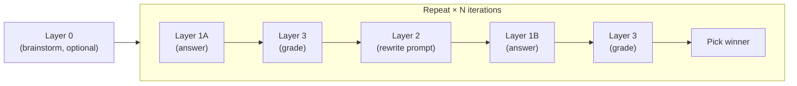

# LLM InSights

> A browser-based tool for iterative prompt optimization, multi-model A/B testing, and structured LLM evaluation — compare models, refine prompts automatically, and generate scored synthetic data.

[](https://www.python.org/downloads/)
[](./LICENSE)


*Walkthrough (~1.5 min)*

---

## What It Does

You write a prompt. The tool sends it to two competing LLM models, grades both answers against a configurable rubric, optionally rewrites the prompt using grader feedback, and repeats the cycle — keeping the best answer each round. Every variable is controlled from the UI: which models compete, what the rubric measures, how categories are weighted, and when the loop stops.

Each run produces a structured record of prompts, answers, scores, and model metadata that can double as refined synthetic data.

---

## Key Capabilities

- **Custom Grading Rubrics** — Define up to 8 grading categories, each with its own rubric text, grader model, and weight. Save named configurations and switch between them at any time.
- **Automatic Prompt Optimization** — The system rewrites your prompt after each iteration using grader feedback, category weights, and best answers as context. Techniques like Chain-of-Thought, Few-Shot, Tree of Thoughts, and Role Prompting are applied automatically while preserving the original intent.
- **Multi-Model A/B Testing** — Assign different models to each answering slot and compare their outputs head-to-head. The Advanced panel supports per-iteration model assignments for systematic cross-model comparisons.
- **Synthetic Data Generation** — Every run produces structured (prompt, answer, multi-dimensional scores) tuples and (original prompt, improved prompt) pairs. The JSONL ledger records prompts, replies, models, scores, and token counts. Multi-prompt sessions chain context across prompts for multi-turn synthetic conversations.
- **Session Review and Analysis** — Browse, load, and analyze past runs with per-prompt iteration stats, score grids, and an in-depth analysis modal featuring bar/radar charts, token usage breakdowns, runtime charts, and adjustable weights for what-if exploration.

---

## How the Pipeline Works



| Layer | Role |
|---|---|
| **Layer 0** | Optional brainstorming step. Generates concise alternative ideas or directions before the loop begins. |
| **Layer 1A / 1B** | Two competing answer models. Each produces a full response to the prompt (or improved prompt). |
| **Layer 2** | Prompt improver. Rewrites the prompt using grader feedback, best answers, and micro-replies as context. |
| **Layer 3** | Multi-category grader. Each category is evaluated independently by its own small LLM, scores are weighted and combined. |

### Stop Conditions

The loop ends when the first of these is met:

1. The best score reaches the target grade (default: 100).
2. Degradation break is enabled and the score drops from the previous iteration.
3. The maximum number of iterations is reached (default: 5).

---

## Pages

| Page | Path | Purpose |
|---|---|---|
| **Login** | `/login` | Simple authentication with an animated background |
| **Main Analysis** | `/` | Run experiments, configure models and toggles, view live results and charts |
| **Config Graders** | `/config_graders` | Create and edit grading rubrics — categories, rubric text, grader models, weights |
| **Review History** | `/review_chats` | Browse saved runs, load or delete past sessions, open the deeper analysis modal |

---

## Frontend Controls

### Main Page — Sidebar (Model Selection)

| Control | Purpose |
|---|---|
| **Layer 0 Model** (Ideas) | Selects the brainstorming model that runs before the loop |
| **Answer Model 1** (Layer 1A) | First answer model in each iteration |
| **Answer Model 2** (Layer 1B) | Second answer model in each iteration |
| **Prompt Improver** (Layer 2) | Model that rewrites prompts using grader feedback |
| **Advanced Panel** | Per-iteration model assignment for Layers 1A, 1B, and 2. Locks main selectors when saved |
| **System Profile** | Filters model dropdowns by hardware tier (Simple / Good / Super) — browser-side only |

### Main Page — Controls Area

| Control | Purpose |
|---|---|
| **Advise Models by Domain** | Visual filter for model dropdowns (Coding, Creative, Science, Experimental, Balanced) |
| **Domain Selection** | Weight profile preset (Balanced, Accuracy, Creativity, Conciseness) |
| **Break Target Grade** | Stop the loop when this score is reached (1--100) |
| **Iterations** | Maximum refinement rounds per prompt (1--5) |
| **Degradation Break** | Stop if the score drops from the previous iteration |
| **Change Prompt** | Enable or disable Layer 2 prompt rewriting |
| **Give Ideas** | Enable or disable Layer 0 brainstorming |
| **Last Best Answer Retention** | Feed the best answer from the previous iteration as context into the next |
| **Grade vs. Current / First Prompt** | Choose whether graders judge the answer against the current or the first prompt in the session |

### Main Page — Weights and Grader Settings

| Control | Purpose |
|---|---|
| **Weight Inputs** | Adjust category weights (auto-normalized). Apply and Reset buttons |
| **Grader Setting Selector** | Switch between saved grading rubrics |
| **Config Graders Link** | Opens the rubric editor page |

### Main Page — Action Buttons

| Button | Purpose |
|---|---|
| **START ANALYSIS** | Runs the iterative analysis loop |
| **Clear Chat** | Backs up and resets all runtime state |
| **Upload Chat** | Imports a previously exported JSON backup |
| **Download Chat** | Exports the session as a human-readable text log or a full restorable JSON backup |
| **Review History** | Opens the Review page |

### Config Graders Page

| Control | Purpose |
|---|---|
| **Load Setting** | Select and load an existing grading rubric |
| **Edit / Cancel** | Toggle edit mode for the grading keys table |
| **Key Name** | Category name (auto-lowercased, spaces converted to underscores) |
| **Rubric** | Free-text description of scoring criteria |
| **Grader Model** | Select which small LLM evaluates this category |
| **Weight %** | How much this category counts toward the overall score |
| **Add / Remove Keys** | Add a row (max 8) or remove an existing one |
| **Weight Total Indicator** | Live sum — green at 100%, red otherwise |
| **Save Setting** | Persist the configuration (blocked if incomplete or named `default`) |

### Review Page

| Control | Purpose |
|---|---|
| **Chat List** | Browse all saved backups, newest first |
| **Prompt Summary** | Scores, categories, models, and iterations for each prompt |
| **Iteration Cards** | Layer 1A vs. 1B detail with winner, model, and runtime |
| **Analyze Deeper** | Modal with average grade bar/radar charts, token usage chart, runtime chart, per-key charts, adjustable weights for what-if analysis, and the grader setting name from the original run |
| **Load This Chat** | Restore a backup into the active session |
| **Delete Chat** | Remove a backup file permanently |
| **Upload** | Import and restore a JSON backup |

---

## Models and Providers

Calls are routed automatically based on the model name:

| Provider | Models | Transport |
|---|---|---|
| **Ollama** | All models not listed below (local inference) | `ollama.chat()`, threaded with timeout |
| **Mistral API** | `mistral-small-2506`, `voxtral-mini-2507`, `open-mistral-nemo-2407` | REST with retry and backoff |
| **Google Gemini API** | `gemini-2.5-flash`, `gemini-2.5-pro` | REST with retry |
| **GLM-4 (HuggingFace)** | `glm-4-9b`, `glm-4-9b-chat` | Local `transformers`, cached, preloaded at startup |

28 preconfigured models are available across layers, including gemma, granite, llama, qwen, deepseek-r1, deepseek-coder-v2, falcon3, phi4, devstral, solar, codellama, dolphin3, olmo2, starcoder2, and gpt-oss.

---

## Getting Started

### Prerequisites

- **Python 3.10+**
- **[Ollama](https://ollama.com/)** installed and running (required for local model inference unless you configure cloud-only providers)
- A `.env` file with your credentials (see below)

### Installation

```bash
git clone https://github.com/yuvhaim-gif/LLM_InSight.git
cd LLM_InSight
python -m venv venv
source venv/bin/activate   # Linux / macOS
venv\Scripts\activate      # Windows
pip install -r requirements.txt
cp .env.example .env       # then edit .env with your credentials
```

> **Note:** The file `secrets_config.py` is required by the application but is excluded from version control via `.gitignore`. If it is missing after cloning, create it in the project root with the following content:
>
> ```python
> import os
> import sys
> from dotenv import load_dotenv
>
> load_dotenv()
>
> _REQUIRED = ["APP_USER", "APP_PASS", "FLASK_SECRET"]
> _OPTIONAL = ["MISTRAL_API_KEY", "GOOGLE_API_KEY", "LANGCHAIN_API_KEY"]
>
> _missing = [k for k in _REQUIRED if k not in os.environ]
> if _missing:
>     print(f"ERROR: Missing required environment variables: {', '.join(_missing)}", file=sys.stderr)
>     print("Copy .env.example to .env and fill in your values.", file=sys.stderr)
>     sys.exit(1)
>
> _skipped = [k for k in _OPTIONAL if not os.environ.get(k)]
> if _skipped:
>     print(f"NOTE: Optional keys not set: {', '.join(_skipped)}. Related providers will return errors when called.", file=sys.stderr)
>
> ADMIN_USER = os.environ["APP_USER"]
> ADMIN_PASS = os.environ["APP_PASS"]
> FLASK_SECRET = os.environ["FLASK_SECRET"]
> MISTRAL_API_KEY = os.environ.get("MISTRAL_API_KEY", "")
> GOOGLE_API_KEY = os.environ.get("GOOGLE_API_KEY", "")
> LANGCHAIN_API_KEY = os.environ.get("LANGCHAIN_API_KEY", "")
> LANGCHAIN_PROJECT = os.environ.get("LANGCHAIN_PROJECT", "llminsight")
> ```

### Environment Variables

Copy `.env.example` to `.env` and fill in your values.

| Variable | Required | Purpose |
|---|---|---|
| `APP_USER` | Yes | Login username |
| `APP_PASS` | Yes | Login password |
| `FLASK_SECRET` | Yes | Flask session secret (any random string) |
| `MISTRAL_API_KEY` | No | Enables Mistral models. If omitted, those models return errors when called |
| `GOOGLE_API_KEY` | No | Enables Google Gemini models. If omitted, those models return errors when called |
| `LANGCHAIN_API_KEY` | No | Enables [LangSmith](https://smith.langchain.com/) tracing. If omitted, tracing is disabled |
| `LANGCHAIN_PROJECT` | No | LangSmith project name (defaults to `llminsight`) |
| `PORT` | No | Server port (defaults to `5000`) |
| `SSL_CERT_PATH` / `SSL_KEY_PATH` | No | Paths to SSL certificate and key for HTTPS |

**Minimal `.env`** (Ollama-only, no cloud APIs):

```
APP_USER=admin
APP_PASS=changeme
FLASK_SECRET=changeme
```

The app runs with just these three variables. Missing optional keys are noted at startup; models routed to a provider without a key return error responses, but the app itself continues to work normally.

> **Important:** The default Layer 2 (prompt improver) model is `open-mistral-nemo-2407`, which requires `MISTRAL_API_KEY`. If you are running Ollama-only without a Mistral key, either disable the **Change Prompt** toggle in the UI or change `DEFAULT_LAYER2_MODEL` in `config.py` to an Ollama model (e.g., `gemma2:9b`).

### Pull Ollama Models

Pull the default models used by each layer (skip any you don't plan to use):

```bash
ollama pull gemma:7b-instruct-q4_K_M   # Layer 1A default
ollama pull granite4:latest              # Layer 1B default
ollama pull gemma2:9b                    # Layer 0 default
ollama pull phi3:mini                    # Layer 3 grader (accuracy)
ollama pull gemma2:2b                    # Layer 3 grader (clarity)
ollama pull qwen2.5:1.5b                # Layer 3 grader (conciseness, structure)
ollama pull llama3.2:3b                  # Layer 3 grader (creativity)
```

The full list of preconfigured models is in `config.py`.

### Run

```bash
python main.py
```

Open `http://localhost:5000` and sign in with the credentials from your `.env` file.

---

## Disabling Providers You Don't Need

If you only want to use a subset of providers, leave the corresponding API key out of `.env`:

- **No Mistral**: omit `MISTRAL_API_KEY`. Avoid selecting Mistral models in the UI and update `DEFAULT_LAYER2_MODEL` in `config.py` to an Ollama or Gemini model.
- **No Google Gemini**: omit `GOOGLE_API_KEY`. Avoid selecting Gemini models in the UI.
- **No LangSmith**: omit `LANGCHAIN_API_KEY`. Tracing fails silently; the app works normally.
- **No GLM-4**: remove `glm-4-9b` and `glm-4-9b-chat` from the model lists in `config.py`. Optionally remove `transformers` and `torch` from `requirements.txt` to save disk space.
- **No Ollama**: remove Ollama-only models from the model lists in `config.py`, remove `ollama` from `requirements.txt`, and update the default model constants (`DEFAULT_LAYER1A_MODEL`, `DEFAULT_LAYER1B_MODEL`, `DEFAULT_LAYER0_MODEL`, `LAYER3_GRADER_MODELS`).

---

## Adding Your Own Models

### New Ollama model

1. Pull it: `ollama pull your-model-name`
2. Add the model name to the appropriate list(s) in `config.py`
3. It appears in the UI dropdowns immediately

### New cloud API provider

1. Add your API key to `.env` and load it in `secrets_config.py`
2. Add a routing check and call function in `ai/api_calls.py` (follow the existing Gemini/Mistral pattern)
3. Add the model names to the lists in `config.py`

### New grader model

Add the model name to `AVAILABLE_GRADER_MODELS` in `config.py`. The model must be available via Ollama. It will appear in the grader model dropdown on the Config Graders page.

### Changing defaults

Edit the `DEFAULT_*` constants in `config.py` (`DEFAULT_LAYER1A_MODEL`, `DEFAULT_LAYER1B_MODEL`, `DEFAULT_LAYER0_MODEL`, `DEFAULT_LAYER2_MODEL`, `LAYER3_GRADER_MODELS`).

---

## Running Tests

```bash
pip install -r requirements-dev.txt
pytest tests/ -v --tb=short
```

The contract tests validate backup schema, restore behavior, advanced model map compatibility, auth matrix, and provider routing. Tests use monkeypatched temp directories and an isolated SQLite database — no production files are touched, no AI models are called, and no `.env` file is required.

---

## Persistence and Backup

- **Session state**: authentication, selected models, weights, toggles, prompt history, advanced model maps, and the active grader setting name are stored in the server-side session and a SQLite database.
- **Runtime files**: `ledger.jsonl` (append-only event log), `iteration_history.json`, `best_best_layer1.json`, `console_output.txt`, and `graderdata/` (JSONL grader settings).
- **Browser storage**: `localStorage` (domain filter, weight preset, system type) and `sessionStorage` (review-to-main handoff).
- **Lifecycle**: startup, login, clear-chat, logout, exit, window close, and process signals each trigger backups of runtime files before clearing them.
- **JSON export** (version 2.0): captures console output, prompt history, iteration history, best-best cache, ledger entries, and full session state. Restorable via upload or the Review page.

---

## Observability

LangSmith/LangChain tracing is available on all AI layers via `@traceable` decorators. Set `LANGCHAIN_API_KEY` in `.env` to enable it. If the key is missing or invalid, tracing is disabled and the app continues to function normally.

---

## Project Structure

| Path | Purpose |
|---|---|
| `main.py` | Application entry point |
| `config.py` | Models, paths, default weights |
| `secrets_config.py` | Credentials loaded from `.env` |
| `graderdata/` | JSONL grader setting files |
| `routes/` | `web_routes.py`, `api_routes.py`, `review_routes.py` |
| `ai/` | `iterative_loop.py`, `layer0.py`, `layer1.py`, `layer2.py`, `layer3.py`, `api_calls.py` |
| `models.py` | Pydantic schemas (`Layer2Response`, `Layer2Critique`) |
| `utils/` | `session.py`, `file_io.py`, `common.py`, `text_processing.py`, `validation.py`, `grader_settings.py` |
| `state.py`, `db.py` | Hybrid state management (SQLite + in-memory) |
| `templates/` | Jinja2 templates (login, main, review, config_graders) with shared partials |
| `static/` | CSS, JavaScript, and assets |
| `tests/` | Pytest contract tests |

---

## Dependencies

| Package | Purpose |
|---|---|
| [Flask](https://flask.palletsprojects.com/) | Web framework, routing, sessions, template rendering |
| [Pydantic](https://docs.pydantic.dev/) | Data validation for Layer 2 response schemas |
| [ollama](https://github.com/ollama/ollama-python) | Python client for Ollama local inference |
| [requests](https://requests.readthedocs.io/) | HTTP client for Mistral and Gemini REST APIs |
| [python-dotenv](https://github.com/theskumar/python-dotenv) | Load `.env` into environment variables |
| [transformers](https://huggingface.co/docs/transformers/) | HuggingFace model loading for GLM-4 (optional) |
| [torch](https://pytorch.org/) | PyTorch backend for GLM-4 inference (optional) |
| [langsmith](https://docs.smith.langchain.com/) | Tracing and observability (optional) |
| [Chart.js](https://www.chartjs.org/) | Frontend charts (bar, radar, line) via CDN |
| [pytest](https://docs.pytest.org/) | Test suite (dev dependency) |

---

## Further Documentation

- [Architecture](./docs/ARCHITECTURE.md) — system design and component layout
- [Implementation](./docs/IMPLEMENTATION.md) — route contracts, JSON schemas, layer behavior
- [Refactoring Notes](./docs/REFACTORING.md) — maintenance guidance and implementation notes
- [User Guide](./docs/user%20guide.md) — end-user walkthrough

---

## Contributing

Contributions are welcome. If you'd like to help improve LLM InSights, please open an issue to discuss your idea before submitting a pull request. Bug reports, feature suggestions, and documentation improvements are all appreciated.

---

## License

This project is released under the [MIT License](./LICENSE).
