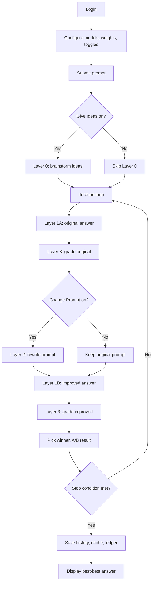

# Architecture

How the demo is structured — components, data flow, and persistence. The system enables creating custom grading rubrics, automatic prompt optimization, A/B model testing, and synthetic data refinement, all controlled through frontend selectors and pages.

## Components

| Component | Files | Role |
|---|---|---|
| App bootstrap | `main.py` | Flask app setup, startup/exit cleanup, SSL, signal handlers (SIGINT/SIGTERM), GLM preload |
| Configuration | `config.py`, `secrets_config.py` | Model lists, file paths, default weights, credentials (via `.env`; only `APP_USER`, `APP_PASS`, `FLASK_SECRET` are required — provider API keys are optional and print a note at startup if missing) |
| Grader settings | `utils/grader_settings.py`, `graderdata/*.jsonl` | Named grading configurations: keys, rubrics, models, weights (CRUD, JSONL storage) |
| Web routes | `routes/web_routes.py` | Dashboard rendering (`/`, `/config_graders`), prompt submission |
| API routes | `routes/api_routes.py` | Auth, model/weight/toggle updates, grader settings CRUD, progress, backup |
| Review routes | `routes/review_routes.py` | Saved-chat browsing, load, delete, upload, backup analysis |
| Blueprint registration | `routes/__init__.py` | Registers `api_bp` and `main_bp` |
| Loop orchestrator | `ai/iterative_loop.py` | Runs the full iteration pipeline per prompt |
| Layer 0 | `ai/layer0.py` | Brainstorming ideas (optional, runs once before loop) |
| Layer 1 | `ai/layer1.py` | Answer generation (two variants: original + improved) |
| Layer 2 | `ai/layer2.py` | Prompt rewriting using grader feedback, weights, and context |
| Layer 3 | `ai/layer3.py` | Parallel multi-category grading with retries (1-8 configurable categories) |
| Provider routing | `ai/api_calls.py` | Routes calls to Ollama, Mistral, Gemini, or GLM-4 |
| Data models | `models.py` | Pydantic: `Layer2Response`, `Layer2Critique` |
| Session helpers | `utils/session.py` | Session accessors, advanced mode detection, model selection tracking |
| File I/O | `utils/file_io.py` | Ledger, history, backup, console output, chat JSON export |
| Text processing | `utils/text_processing.py` | Console parsing, similarity, deduplication, answer extraction |
| Common utilities | `utils/common.py` | Scoring, JSON parsing, error detection, `@traceable` wrapper |
| Validation | `utils/validation.py` | Input/integer/float/model validators |
| State database | `db.py` | SQLite-backed per-session state (iteration counter, processing flag, model counter) with thread-safe access |
| Runtime state | `state.py` | Hybrid state module: delegates per-session serializable state to SQLite via `db.py`, keeps GLM cache/lock/cancel in-memory |
| Frontend JS | `static/js/shared/` (utils, chart-helpers, deeper-analysis), `static/js/main/` (weights, filters, toggles, models, grader-settings, download, upload, processing, advanced, init), `static/js/review/` (state, chat-list, prompt-view, prompt-chart, modals, init), `static/js/config_graders.js` | Modular scripts loaded per page; shared modules provide common utilities and the Deeper Analysis modal |
| Frontend CSS | `static/css/shared.css` (base reset, body gradient, star overlay, keyframes, footer, logo-circle, deeper-analysis modal), `static/css/main.css`, `static/css/review.css`, `static/css/config_graders.css` | Shared base styles loaded first; page-specific files contain only overrides and unique rules |
| Template partials | `templates/partials/_head_common.html` (meta, favicon, font, shared.css), `_head_charts.html` (Chart.js CDN), `_footer.html`, `_logo_badge.html` (parameterized size), `_deeper_analysis_modal.html`, `_model_icon.html` (cloud icon macro), `_model_selector.html` (sidebar selector macro) | Jinja2 includes and macros eliminating repeated HTML across the 4 page templates |
| Contract tests | `tests/conftest.py`, `tests/test_backup_schema.py`, `tests/test_restore_behavior.py`, `tests/test_advanced_map_compat.py`, `tests/test_auth_matrix.py`, `tests/test_provider_routing.py` | 102 pytest contract tests validating shapes, boundaries, routing, and auth. No AI calls, no network, temp-dir isolation |

## Provider Routing

`ai/api_calls.py` checks model name membership to pick a provider:

- **Mistral**: `mistral-small-2506`, `voxtral-mini-2507`, `open-mistral-nemo-2407` -> Mistral REST API
- **GLM-4**: `glm-4-9b`, `glm-4-9b-chat` -> HuggingFace `transformers` (local, CUDA/CPU, cached by HF model ID, preloaded at startup, unloaded on exit/process signal)
- **Gemini**: `gemini-2.5-flash`, `gemini-2.5-pro` -> Google Gemini REST API
- **Everything else** -> Ollama local inference

All providers return a standardized `{ content, token_info: { tool, input_tokens, output_tokens, total_tokens } }` response.

Timeouts: 240s per layer call, 300s transport default. Rate-limited APIs (Mistral, Gemini) retry automatically with backoff.

## Execution Flow

Stop conditions checked in order: score >= target grade, degradation break (score dropped), max iterations reached.

## Frontend-Driven Capabilities

All experiment configuration is done through the browser — no code changes required.

### Creating Custom Grading Rubrics

The Config Graders page (`/config_graders`) provides a full editor for grading rubrics:
- Define 1-8 grading categories, each with a key name, rubric description, grader model, and weight.
- Save named configurations as JSONL files in `graderdata/`.
- Switch between rubrics on the main page via the grader setting selector.
- The `default` setting is read-only; custom settings can be created, edited, and overwritten.

### Automatic Prompt Optimization

When the Change Prompt toggle is enabled, Layer 2 rewrites the prompt each iteration:
- Uses grader feedback (scores + critique) from the previous iteration.
- Incorporates category weights to prioritize weak areas.
- Applies prompt engineering techniques (CoT, Few-Shot, ToT, Role Prompting, CoVe, Skeleton-of-Thought) as needed.
- Preserves the original prompt's intent and constraints.

### A/B Model Testing

- Layer 1A and Layer 1B can use different models, enabling head-to-head comparison.
- The Advanced panel allows per-iteration model assignment for Layer 1A, 1B, and Layer 2.
- Each iteration produces an A/B result with scores, winner, and model metadata.

### Synthetic Data Refinement

- Each iteration produces (prompt, answer, multi-dimensional scores) tuples.
- Layer 2 generates (original prompt, improved prompt) pairs.
- The JSONL ledger records every call with full metadata.
- Multi-prompt sessions chain context for multi-turn conversations.

### Review Page as Analysis Tool

The Review page (`/review_chats`) serves as a log and deeper analysis tool:
- Browse all saved backups, sorted by date.
- Per-prompt iteration stats with scores, models, runtimes, and token usage.
- Dynamic score grids that render whatever grading keys were used in the run.
- Analyze Deeper modal with average grade bar/radar charts, token usage chart, runtime chart, per-key charts, adjustable weights for what-if, and grader setting context.
- Load past sessions back into the main page for continued experimentation.

## Controls

### Backend (session-stored, updated via API)

- **Models**: Layer 1A, 1B, 0, 2 selectors + per-iteration advanced maps
- **Grader settings**: named configurations stored as JSONL in `graderdata/`. Each defines 1-8 grading keys with key name, rubric, grader model, and default weight. The `default` setting is read-only. Custom settings are created and managed via the Config Graders page (`/config_graders`). The active setting name is tracked in the session and included in chat backups.
- **Weights**: configurable categories (1-8 per grader setting), normalized to sum 1. Priority: user-applied custom weights -> active grader config defaults -> hardcoded defaults. Switching grader settings clears custom weights.
- **Toggles**: degradation break, change prompt, give ideas, last-best context, grade-vs-prompt mode (`current` or `first`)
- **Loop parameters**: break target grade (1-100), max iterations (1-5)

### Frontend-only (browser storage, no backend effect)

- Domain advisor filter (`localStorage`)
- Grade profile preset selector (`localStorage`)
- Deeper-analysis modal weights (temporary, chart-only)
- System type selector (`localStorage`) — filters model dropdowns by speed category

## Prompt and Context

- Prompt history tracked in `session['prompt_history']`.
- Layer 0 produces up to 5 micro-idea directions (not full answers).
- Layer 1 can carry accumulated context from previous iterations when `layer1_last_best_context_enabled` is on.
- Layer 2 receives: grader feedback + scores, best-best reply, last iteration reply, micro-replies, recent prompts, category weights. Uses CoT, Few-Shot, ToT, Role Prompting, CoVe, and other techniques as needed.
- Layer 3 grades against the current prompt or the first prompt in the session, depending on `grade_vs_prompt_mode`.
- Multi-prompt sessions: best answer from prompt N carries forward as context into prompt N+1.

## Persistence

### Server-side

| Store | Contents |
|---|---|
| Flask session | Auth, models, weights, toggles, prompt history, advanced maps, grader setting name, min_grade, max_iterations |
| `ledger.jsonl` | Append-only Layer 1 and Layer 3 events with timestamps, models, tokens |
| `iteration_history.json` | Prompt-indexed iteration arrays with scores, models, runtimes, tokens, A/B results |
| `best_best_layer1.json` | Current best/tied entries with prompt number and timestamp |
| `console_output.txt` | Captured runtime console stream |
| `runtime_state.db` | SQLite database storing per-session runtime state (iteration counter, processing flag, models executed). Auto-created on first startup, cleaned up on exit |
| `backup/` | Timestamped copies created on lifecycle events |
| `graderdata/` | JSONL grader setting files (key, rubric, grader, weight per line) |

### Browser-side

| Store | Contents |
|---|---|
| `localStorage` | Domain filter, grade weights preset, system type |
| `sessionStorage` | One-time handoff values when loading a chat from review page |

## Lifecycle

| Event | Backs up | Clears |
|---|---|---|
| Startup | ledger, best-best, iteration history, console | ledger, best-best, iteration history. Init state DB, clean up old sessions |
| Login | all files + chat JSON | console, ledger, best-best. Reset per-session state |
| Clear Chat | all files + chat JSON | all four working files. Reset per-session state |
| Logout | all files + chat JSON | all four working files. Reset per-session state |
| Exit | all files + chat JSON | ledger, best-best, iteration history. Clean up all session state rows |
| Window close | -- | -- (sends `/shutdown-notify` via `sendBeacon`) |
| Signal (SIGINT/SIGTERM) | all files + chat JSON (via atexit) | ledger, best-best, iteration history |

GLM models are loaded once at startup and unloaded on exit or process signal, releasing GPU/CPU resources.

## Observability

LangSmith/LangChain tracing enabled via environment variables in `config.py`. Each AI layer function uses `@traceable` (falls back to a no-op decorator if `langsmith` is not installed). The iterative loop is traced as a `chain` run type.

## References

- [README.md](../README.md)
- [IMPLEMENTATION.md](./IMPLEMENTATION.md)
- [REFACTORING.md](./REFACTORING.md)
- [user guide.md](./user%20guide.md)
