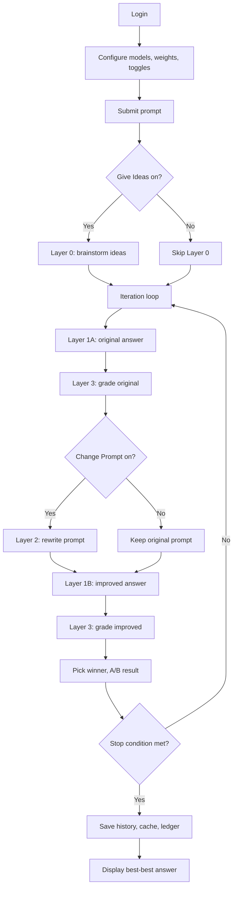

# Architecture

How the tool is structured — components, data flow, and persistence. It enables creating custom grading rubrics, automatic prompt optimization, A/B model testing, and synthetic data refinement, all controlled through frontend selectors and pages.

## Components

| Component | Files | Role |
|---|---|---|
| App bootstrap | `main.py` | Flask app setup, startup/exit cleanup, SSL, signal handlers (SIGINT/SIGTERM), GLM preload |
| Configuration | `config/settings.py`, `config/secrets.py`, `config/__init__.py` | Model lists, file paths, default weights, credentials (via `.env`; only `APP_USER`, `APP_PASS`, `FLASK_SECRET` are required — provider API keys are optional and print a note at startup if missing) |
| Grader settings | `utils/grader_settings.py`, `graderdata/*.jsonl` | Named grading configurations: keys, rubrics, models, weights (CRUD, JSONL storage) |
| Web routes | `routes/web_routes.py` | Dashboard rendering (`/`, `/config_graders`), prompt submission |
| API routes | `routes/api_routes.py` | Auth, model/weight/toggle updates, grader settings CRUD, progress, backup |
| Review routes | `routes/review_routes.py` | Saved-chat browsing, load, delete, upload, backup analysis |
| Blueprint registration | `routes/__init__.py` | Registers `api_bp`, `main_bp`, and the Preference Studio `pref_bp` |
| Preference Studio | `preference/` (`store.py`, `extract.py`, `active_learning.py`, `calibrate.py`, `conflicts.py`, `dataset.py`, `export.py`, `routes.py`) | Isolated human-in-the-loop layer: pairwise judging, grader calibration metrics/re-fit/re-grade, per-chat conflicts reporting across grading versions, curated pool building, and training-set export. Calls existing grading logic; never mutates the live ledger. State lives in its own SQLite DB and export/regrade dirs. Routes `/arena` and `/dataset` render the unified `studio.html`. See [preference_studio.md](./preference_studio.md) |
| Loop orchestrator | `ai/iterative_loop.py` | Runs the full iteration pipeline per prompt. Token usage accumulated incrementally via `_merge_token_usage` across all 6 layers (layer0, layer1a, layer1b, layer2, layer3a, layer3b), including Layer 3's nested per-category structure (no post-loop scan). Session ID cached in thread-local at loop entry. Summary display and tie resolution delegated to `ai/iteration_summary.py` |
| Iteration summary | `ai/iteration_summary.py` | Extracted presentation logic: `resolve_ties_and_save` (tie deduplication + final cache save), `print_model_usage_summary` (per-iteration model usage), `print_final_summary` (best-best/tie/fallback display). Called by the loop orchestrator at the end of each prompt run |
| Layer 0 | `ai/layer0.py` | Brainstorming ideas (optional, runs once before loop) |
| Layer 1 | `ai/layer1.py` | Answer generation (two variants: original + improved) |
| Layer 2 | `ai/layer2.py` | Prompt rewriting using grader feedback, weights, and context |
| Layer 3 | `ai/layer3.py` | Multi-category grading with retries (1-8 configurable categories); categories grouped by grader model, groups run concurrently via `ThreadPoolExecutor` while same-model categories run sequentially within a group |
| Provider routing | `ai/api_calls.py` | Routes calls to Ollama, Mistral, Gemini, or GLM-4. Post-thread result handling consolidated in `_handle_thread_result` helper (used by Gemini, Mistral, GLM; Ollama preserves its timeout-specific print). When Ollama is not installed/importable, returns `[OLLAMA_ERROR]` prefix so the error is correctly detected by `is_error_response()` and Layer 3 grading is skipped |
| Data models | `core/models.py` | Pydantic: `Layer2Response`, `Layer2Critique` |
| Session helpers | `utils/session.py` | Session accessors, advanced mode detection, model selection tracking. Verbose accessor logs use `logging.debug` (not console print). `get_layer3_grader_models()` falls back to session-stored graders when the named grader setting file is missing on disk (e.g., after restoring a backup from another machine). Uses centralized key constants from `utils/session_keys.py` |
| Session keys | `utils/session_keys.py` | Centralized string constants for all Flask session keys (`SK_LOGGED_IN`, `SK_USER`, `SK_PROMPT_HISTORY`, `SK_CUSTOM_WEIGHTS`, etc.). Imported by `utils/session.py`, `routes/api_routes.py`, `routes/web_routes.py`, and `ai/iterative_loop.py` to eliminate magic strings |
| File I/O | `utils/file_io.py` | Ledger, history, backup, console output, chat JSON export. `backup_chat_json` guards session access with `has_request_context()` so exit-time backups succeed with file-based data when no Flask request context is available |
| Text processing | `utils/text_processing.py` | Console parsing, similarity, deduplication, answer extraction. Pre-compiled regex constants for HTML tags, horizontal rules, whitespace, iteration/prompt markers. Batched `_CLEAN_REPLACEMENTS` tuple for `clean_answer_text` |
| Common utilities | `utils/common.py` | Scoring, JSON parsing, error detection, `@traceable` wrapper, `ERROR_PREFIXES` constant, pre-compiled regex for code fences and JSON extraction. `create_failed_grade_entry` accepts optional `score_weights` to ensure correct score computation with custom grader keys |
| Validation | `utils/validation.py` | Input/integer/float/model validators |
| State database | `core/db.py` | SQLite-backed per-session state (iteration counter, processing flag, model counter) with thread-safe access. Uses per-call connections with `try/finally` to prevent stale connection issues |
| Runtime state | `core/state.py` | Hybrid state module: delegates per-session serializable state to SQLite via `core/db.py`, keeps GLM cache/lock/cancel in-memory. Thread-local session ID cache (`set_cached_session_id`/`clear_cached_session_id`) avoids repeated Flask session lookups during loop runs |
| Frontend JS | `static/js/shared/` (utils, chart-helpers, deeper-analysis), `static/js/main/` (weights, filters, toggles, models, grader-settings, download, upload, processing, advanced, init), `static/js/review/` (state, chat-list, prompt-view, prompt-chart, modals, init), `static/js/studio/init.js` (Preference Studio orchestrator) reusing `static/js/arena/` (state, api, arena, refine), `static/js/dataset/` (table, export), `static/js/calibrate/panel.js`, `static/js/config_graders.js` | Modular scripts loaded per page; shared modules provide common utilities and the Deeper Analysis modal |
| Frontend CSS | `static/css/shared.css` (base reset, body gradient, star overlay, keyframes, footer, logo-circle, deeper-analysis modal), `static/css/main.css`, `static/css/review.css`, `static/css/config_graders.css`, `static/css/studio.css`, `static/css/arena.css`, `static/css/dataset.css` | Shared base styles loaded first; page-specific files contain only overrides and unique rules |
| Template partials | `templates/partials/_head_common.html` (meta, CSRF token meta + `csrf.js`, favicon, font, shared.css), `_head_charts.html` (Chart.js CDN), `_footer.html`, `_logo_badge.html` (parameterized size), `_deeper_analysis_modal.html`, `_model_icon.html` (cloud icon macro), `_model_selector.html` (sidebar selector macro) | Jinja2 includes and macros eliminating repeated HTML across the 5 page templates (login, main, review, config_graders, studio) |
| Contract tests | `tests/conftest.py`, `tests/test_backup_schema.py`, `tests/test_restore_behavior.py`, `tests/test_advanced_map_compat.py`, `tests/test_auth_matrix.py`, `tests/test_provider_routing.py`, `tests/test_route_refactor_parity.py`, `tests/test_csrf.py`, `tests/test_pref_*.py` (Preference Studio) | 217 pytest contract tests (135 core + 82 Preference Studio) validating shapes, boundaries, routing, auth, CSRF, and the full Preference Studio package. No AI calls, no network, temp-dir isolation |

## Provider Routing

`ai/api_calls.py` checks model name membership to pick a provider:

- **Mistral**: `mistral-small-2506`, `voxtral-mini-2507`, `open-mistral-nemo-2407` -> Mistral REST API
- **GLM-4**: `glm-4-9b`, `glm-4-9b-chat` -> HuggingFace `transformers` (local, CUDA/CPU, cached by HF model ID, preloaded at startup, unloaded on exit/process signal)
- **Gemini**: `gemini-2.5-flash`, `gemini-2.5-pro` -> Google Gemini REST API
- **Everything else** -> Ollama local inference

All providers return a standardized `{ content, token_info: { tool, input_tokens, output_tokens, total_tokens } }` response.

Timeouts: 240s per layer call, 300s transport default. Rate-limited APIs (Mistral, Gemini) retry automatically with backoff.

## Execution Flow

```mermaid
flowchart TD
    A[Login] --> B[Configure models, weights, toggles]
    B --> C[Submit prompt]
    C --> D{Give Ideas on?}
    D -->|Yes| E[Layer 0: brainstorm ideas]
    D -->|No| F[Skip Layer 0]
    E --> G[Iteration loop]
    F --> G
    G --> H[Layer 1A: original answer]
    H --> I[Layer 3: grade original]
    I --> J{Change Prompt on?}
    J -->|Yes| K[Layer 2: rewrite prompt]
    J -->|No| L[Keep original prompt]
    K --> M[Layer 1B: improved answer]
    L --> M
    M --> N[Layer 3: grade improved]
    N --> O[Pick winner, A/B result]
    O --> P{Stop condition met?}
    P -->|No| G
    P -->|Yes| Q[Save history, cache, ledger]
    Q --> R[Display best-best answer]
```

Stop conditions checked in order: score >= target grade, degradation break (score dropped), max iterations reached.

## Frontend-Driven Capabilities

All experiment configuration is done through the browser — no code changes required.

### Creating Custom Grading Rubrics

The Config Graders page (`/config_graders`) provides a full editor for grading rubrics:
- Define 1-8 grading categories, each with a key name, rubric description, grader model, and weight.
- Save named configurations as JSONL files in `graderdata/`.
- Switch between rubrics on the main page via the grader setting selector.
- The `default` setting is read-only; custom settings can be created, edited, and overwritten.

### Automatic Prompt Optimization

When the Change Prompt toggle is enabled, Layer 2 rewrites the prompt each iteration:
- Uses grader feedback (scores + critique) from the previous iteration.
- Incorporates category weights to prioritize weak areas.
- Applies prompt engineering techniques (CoT, Few-Shot, ToT, Role Prompting, CoVe, Skeleton-of-Thought) as needed.
- Preserves the original prompt's intent and constraints.

### A/B Model Testing

- Layer 1A and Layer 1B can use different models, enabling head-to-head comparison.
- The Advanced panel allows per-iteration model assignment for Layer 1A, 1B, and Layer 2.
- Each iteration produces an A/B result with scores, winner, and model metadata.

### Synthetic Data Refinement

- Each iteration produces (prompt, answer, multi-dimensional scores) tuples.
- Layer 2 generates (original prompt, improved prompt) pairs.
- The JSONL ledger records every call with full metadata.
- Multi-prompt sessions chain context for multi-turn conversations.

### Review Page as Analysis Tool

The Review page (`/review_chats`) serves as a log and deeper analysis tool:
- Browse all saved backups, sorted by date.
- Per-prompt iteration stats with scores, models, runtimes, and token usage.
- Dynamic score grids that render whatever grading keys were used in the run.
- Analyze Deeper modal with average grade bar/radar charts, token usage chart, runtime chart, per-key charts, adjustable weights for what-if, and grader setting context.
- Load past sessions back into the main page for continued experimentation.

### Preference Studio (Human-in-the-Loop Calibration)

The Preference Studio (`/arena` and `/dataset`, both rendering the unified `studio.html`) closes
the loop between human judgment and the automated grader:

- **Judge tab** — pick a source (live ledger or a saved backup), Scan to build an active-learning
  queue of the hardest/most-uncertain pairs, and vote (better / tie / both bad), optionally adding
  scalar grades, pinning ground truth, or writing a gold answer via Refine.
- **Calibration panel** (on `/config_graders`) — live pairwise accuracy, Cohen's κ, Spearman, and
  per-attribute alignment; re-fit weights (no model calls) or full re-grade (re-runs Layer 3 with
  a candidate config into an isolated dir, never the live ledger).
- **Build & Export tab** — assemble curated pools from the ticked sources, filter by band/
  confidence, and export training-ready JSONL (+ provenance sidecar + dataset card) for a
  production model or a trainable pass/fail judge.
- **Conflicts Report** (⚠️ Report on each source row) — a per-chat reconciliation of your decisive
  judgments against the grader's picks, with a grading-version selector (Original vs. re-grade
  runs, newest auto-selected) whose choice is persisted per chat.

All Preference Studio state is isolated (own SQLite DB + export/regrade dirs) and never touched by
the app's clear/backup of the live session. Full detail in [preference_studio.md](./preference_studio.md).

## Controls

### Backend (session-stored, updated via API)

- **Models**: Layer 1A, 1B, 0, 2 selectors + per-iteration advanced maps
- **Grader settings**: named configurations stored as JSONL in `graderdata/`. Each defines 1-8 grading keys with key name, rubric, grader model, and default weight. The `default` setting is read-only. Custom settings are created and managed via the Config Graders page (`/config_graders`). The active setting name is tracked in the session and included in chat backups.
- **Weights**: configurable categories (1-8 per grader setting), normalized to sum 1. Priority: user-applied custom weights -> active grader config defaults -> hardcoded defaults. Switching grader settings clears custom weights.
- **Toggles**: degradation break, change prompt, give ideas, last-best context, grade-vs-prompt mode (`current` or `first`)
- **Loop parameters**: break target grade (backend clamps to 0-100; UI input range 1-100; default 100), max iterations (1-5)

### Frontend-only (browser storage, no backend effect)

- Domain advisor filter (`localStorage`)
- Grade profile preset selector (`localStorage`)
- Deeper-analysis modal weights (temporary, chart-only)
- System type selector (`localStorage`) — filters model dropdowns by speed category

## Prompt and Context

- Prompt history tracked in `session['prompt_history']`.
- Layer 0 produces up to 5 micro-idea directions (not full answers).
- Layer 1 can carry accumulated context from previous iterations when `layer1_last_best_context_enabled` is on.
- Layer 2 receives: grader feedback + scores, best-best reply, last iteration reply, micro-replies, recent prompts, category weights. Uses CoT, Few-Shot, ToT, Role Prompting, CoVe, and other techniques as needed.
- Layer 3 grades against the current prompt or the first prompt in the session, depending on `grade_vs_prompt_mode`.
- Multi-prompt sessions: best answer from prompt N carries forward as context into prompt N+1.

## Persistence

### Server-side

| Store | Contents |
|---|---|
| Flask session | Auth, models, weights, toggles, prompt history, advanced maps, grader setting name, min_grade, max_iterations |
| `data/ledger.jsonl` | Append-only Layer 1 and Layer 3 events with timestamps, models, tokens |
| `data/iteration_history.json` | Prompt-indexed iteration arrays with scores, models, runtimes, tokens, A/B results |
| `data/best_best_layer1.json` | Current best/tied entries with prompt number and timestamp |
| `data/console_output.txt` | Captured runtime console stream |
| `data/runtime_state.db` | SQLite database storing per-session runtime state (iteration counter, processing flag, models executed). Auto-created on first startup, cleaned up on exit |
| `backup/` | Timestamped copies created on lifecycle events |
| `graderdata/` | JSONL grader setting files (key, rubric, grader, weight per line) |
| `data/preferences.db` | Preference Studio SQLite DB: judgments, queue, blacklist, calibration runs, per-chat grading-version selections. Auto-created on first use; isolated from the live session |
| `data/preferences_export/` | Exported training datasets (JSONL + `*.meta.jsonl` sidecar + `*.card.json`), written atomically |
| `data/preferences_regrade/` | Tier-B re-grade artifacts (never the live ledger) |

### Browser-side

| Store | Contents |
|---|---|
| `localStorage` | Domain filter, grade weights preset, system type |
| `sessionStorage` | One-time handoff values when loading a chat from review page |

## Lifecycle

| Event | Backs up | Clears |
|---|---|---|
| Startup | ledger, best-best, iteration history, console | ledger, best-best, iteration history. Init state DB, clean up old sessions |
| Login | all files + chat JSON | console, ledger, best-best. Reset per-session state |
| Clear Chat | all files + chat JSON | all four working files. Reset per-session state |
| Logout | all files + chat JSON | all four working files. Reset per-session state |
| Exit | all files + chat JSON (session data omitted — only file-based data backed up since no Flask request context is available at exit time) | ledger, best-best, iteration history. Clean up all session state rows |
| Window close | -- | -- (sends `/shutdown-notify` via `sendBeacon`) |
| Signal (SIGINT/SIGTERM) | all files + chat JSON (via atexit; session data omitted — same as Exit) | ledger, best-best, iteration history |

GLM models are loaded once at startup and unloaded on exit or process signal, releasing GPU/CPU resources.

## Observability

LangSmith/LangChain tracing enabled via environment variables in `config/settings.py`. Each AI layer function uses `@traceable` (falls back to a no-op decorator if `langsmith` is not installed). The iterative loop is traced as a `chain` run type.

## Project Structure

| Path | Purpose |
|---|---|
| `main.py` | Application entry point |
| `config/` | `settings.py` (models, paths, default weights), `secrets.py` (credentials via `.env`), `__init__.py` |
| `core/` | `db.py` (SQLite state), `models.py` (Pydantic schemas), `state.py` (hybrid state management) |
| `data/` | Runtime working files (ledger, cache, history, console output, state DB) |
| `graderdata/` | JSONL grader setting files |
| `routes/` | `web_routes.py`, `api_routes.py`, `review_routes.py`, `__init__.py` |
| `preference/` | `store.py`, `extract.py`, `active_learning.py`, `calibrate.py`, `conflicts.py`, `dataset.py`, `export.py`, `routes.py`, `__init__.py` (Preference Studio) |
| `ai/` | `iterative_loop.py`, `iteration_summary.py`, `layer0.py`, `layer1.py`, `layer2.py`, `layer3.py`, `api_calls.py` |
| `utils/` | `session.py`, `session_keys.py`, `file_io.py`, `common.py`, `text_processing.py`, `validation.py`, `grader_settings.py`, `csrf.py` |
| `scripts/` | Developer utility scripts (`check_syntax.py`, `check_modified.py`, `create_graderdata.py`) |
| `templates/` | Jinja2 templates (`login.html`, `main.html`, `review.html`, `config_graders.html`, `studio.html`) + `partials/` |
| `static/css/` | `shared.css`, `main.css`, `review.css`, `config_graders.css`, `studio.css`, `arena.css`, `dataset.css` |
| `static/js/shared/` | `utils.js`, `chart-helpers.js`, `deeper-analysis.js`, `csrf.js` (global `fetch` CSRF wrapper) |
| `static/js/main/` | `init.js`, `weights.js`, `filters.js`, `toggles.js`, `models.js`, `grader-settings.js`, `download.js`, `upload.js`, `processing.js`, `advanced.js` |
| `static/js/review/` | `init.js`, `state.js`, `chat-list.js`, `prompt-view.js`, `prompt-chart.js`, `modals.js` |
| `static/js/studio/` | `init.js` (page orchestrator; reuses the `arena/`, `dataset/`, `calibrate/` logic modules) |
| `static/js/arena/` | `state.js`, `api.js`, `arena.js`, `refine.js`, `conflicts.js` (judging logic + Conflicts Report) |
| `static/js/dataset/` | `table.js`, `export.js` (build/export logic) |
| `static/js/calibrate/` | `panel.js` (Calibration panel on Config Graders) |
| `static/js/` | `config_graders.js` |
| `tests/` | `conftest.py`, `test_backup_schema.py`, `test_restore_behavior.py`, `test_advanced_map_compat.py`, `test_auth_matrix.py`, `test_provider_routing.py`, `test_route_refactor_parity.py`, `test_csrf.py`, `test_pref_*.py` (Preference Studio) |
| `screenshots/` | Demo GIF and images |

## References

- [README.md](../README.md)
- [IMPLEMENTATION.md](./IMPLEMENTATION.md)
- [REFACTORING.md](./REFACTORING.md)
- [preference_studio.md](./preference_studio.md)
- [user guide.md](./user%20guide.md)
